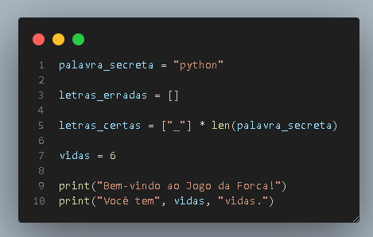
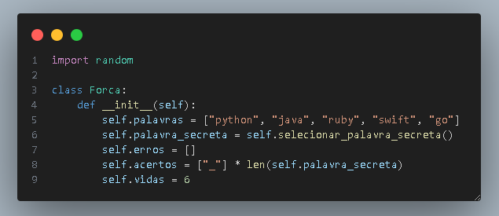

# Descrição
Este é um código em Python que implementa um jogo de Forca (ou Hangman) dentro do arquivo `forca.py`.

## Implementa
- palavras: uma lista de palavras que podem ser escolhidas como palavra secreta.
- palavra_secreta: a palavra secreta escolhida aleatoriamente da lista palavras.
- erros: uma lista de letras que o jogador já adivinhou incorretamente.
- acertos: uma lista de letras que o jogador já adivinhou corretamente.
- vidas: o número de vidas que o jogador tem.

## Tipo de mudança (marcar as alternativas que se encaixam)
- [x] Nova Funcionalidade
- [x] Documentação

# Como foi testado?
Testes manuais rodando as funções passando algumas palavras como parâmetro e utilizando `console.log` para visualizar o resultado no terminal.

Checklist:
- [ ] Meu código segue os padrões do repositório, como gitmoji e commits organizados e com mensagens adequadas
- [x] Meu código segue os padrões deste projeto
- [ ] Escrevi testes automatizados necessários para esta entrega
- [x] Testei exaustivamente a entrega
- [x] Revisei o código que está sendo entregue
- [x] Documentei de alguma forma o que foi feito para auxiliar próximos devs (em código, insomnia, documentos auxiliares)
- [x] Minhas mudanças não geram nenhum motivo de alerta ou possível quebra de outras funcionalidades

# Ajustes :

 

